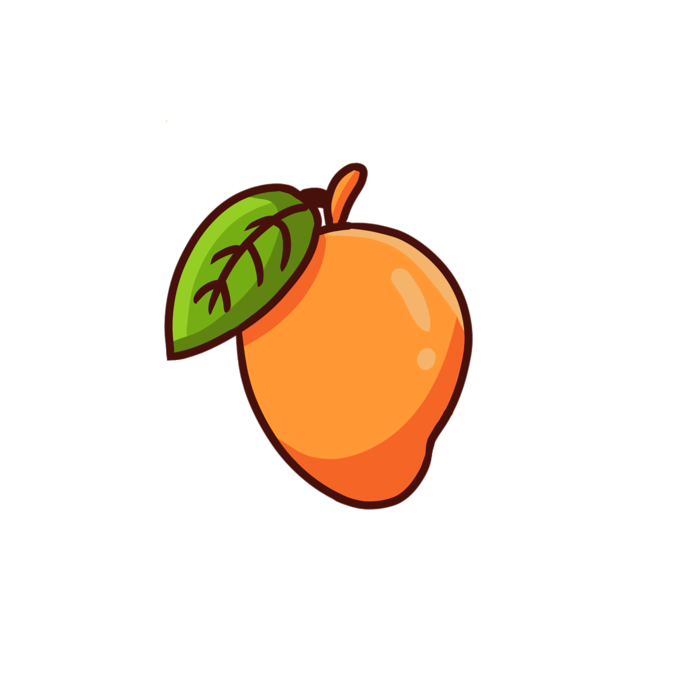

# 🥗 App Nutrição


> Uma solução completa em mobile para conectar nutricionistas aos seus pacientes, facilitando o acompanhamento de dietas, evolução antropométrica e gestão de saúde.

## 📱 Sobre o Projeto

O **App Nutrição** foi desenvolvido para modernizar o acompanhamento nutricional. O sistema permite que nutricionistas criem e gerenciem planos alimentares personalizados, enquanto os pacientes têm acesso fácil às suas dietas e progresso diretamente no smartphone.

O projeto integra a **Tabela TACO** (Tabela Brasileira de Composição de Alimentos) para cálculos nutricionais precisos e utiliza o **Firebase** para autenticação e sincronização de dados em tempo real.

## ✨ Funcionalidades Principais

### 🍎 Para o Paciente
* **Visualização do Plano Alimentar:** Acesso rápido às refeições diárias prescritas.
* **Acompanhamento Antropométrico:** Visualização do histórico de medidas e peso.
* **Cálculos Automáticos:** Integração com calculadora nutricional para feedback instantâneo.
* **Segurança:** Login e recuperação de senha seguros.

### 🧑‍⚕️ Para o Nutricionista
* **Gestão de Pacientes:** Cadastro e listagem completa da carteira de pacientes.
* **Editor de Planos:** Criação e edição de dietas baseadas na tabela TACO.
* **Registro de Medidas:** Inserção e atualização de dados antropométricos (peso, altura, circunferências).
* **Perfil Detalhado:** Acesso rápido ao histórico e necessidades de cada paciente.

## 🛠️ Tecnologias Utilizadas

* **Frontend:** [Flutter](https://flutter.dev/) (Dart)
* **Backend / Database:** [Firebase Firestore](https://firebase.google.com/) (NoSQL)
* **Autenticação:** Firebase Auth
* **Dados Nutricionais:** Integração com a Tabela TACO (DB local/assets)
* **Arquitetura:** MVC Pattern com separação clara de Services, Models e Screens.

## 📸 Screenshots

| Login | Home Nutricionista | Home Paciente | Editor de Dieta |
|:---:|:---:|:---:|:---:|
|  | | | |

## 🚀 Como Rodar o Projeto

Pré-requisitos: Flutter SDK instalado e configurado.

1.  **Clone o repositório**
    ```bash
    git clone [https://github.com/SEU_USUARIO/app_nutricao.git](https://github.com/SEU_USUARIO/app_nutricao.git)
    cd app_nutricao
    ```

2.  **Instale as dependências**
    ```bash
    flutter pub get
    ```

3.  **Configure o Firebase**
    * O projeto depende do arquivo `google-services.json` (Android) e `GoogleService-Info.plist` (iOS). Certifique-se de configurá-los no seu console do Firebase.

4.  **Execute o App**
    ```bash
    flutter run
    ```

## 👨‍💻 Equipa de Desenvolvimento

Projeto idealizado e desenvolvido por:

<table>
  <tr>
    <td align="center">
      <a href="LINK_DO_LINKEDIN_ROBERT">
        <br>
        <sub><b>Robert Gonçalves</b></sub>
      </a><br>
      Full Stack & Architecture
    </td>
    <td align="center">
      <a href="LINK_DO_LINKEDIN_RUBIA">
        <br>
        <sub><b>Rubia Viol</b></sub>
      </a><br>
      UI/UX & Frontend Dev
    </td>
    <td align="center">
      <a href="LINK_DO_LINKEDIN_JULIA">
        <br>
        <sub><b>Julia Zoffoli</b></sub>
      </a><br>
      Database & Logic
    </td>
  </tr>
</table>

## 📄 Licença

Este projeto está sob a licença MIT. Veja o arquivo [LICENSE](LICENSE) para mais detalhes.

Copyright © 2026 App Nutrição Team.
